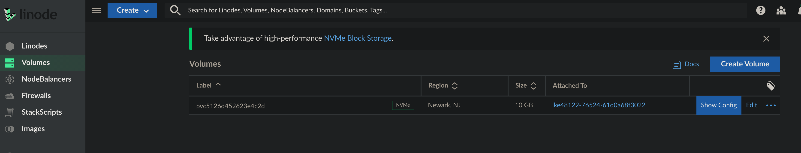
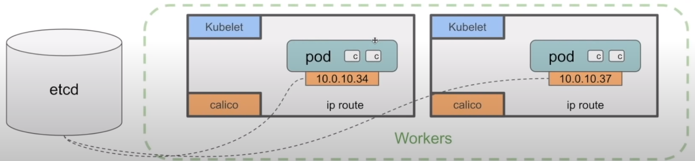

Practicing Kubernetes
=====================

.. contents::

Kubernetes Architecture
-----------------------

Control Plane components
~~~~~~~~~~~~~~~~~~~~~~~~

The control plane's components make global decisions about the cluster (for example, scheduling), as well as detecting and responding to cluster events (for example, starting up a new pod when a deployment's replicas field is unsatisfied).

Control plane components can be run on any machine in the cluster. However, for simplicity, set up scripts typically start all control plane components on the same machine, and do not run user containers on this machine. See Creating Highly Available clusters with kubeadm for an example control plane setup that runs across multiple VMs.

kube-apiserver
++++++++++++++

The API server is a component of the Kubernetes control plane that exposes the Kubernetes API. The API server is the front end for the Kubernetes control plane.

The main implementation of a Kubernetes API server is kube-apiserver. kube-apiserver is designed to scale horizontally—that is, it scales by deploying more instances. You can run several instances of kube-apiserver and balance traffic between those instances.

etcd
++++

Consistent and highly-available key value store used as Kubernetes' backing store for all cluster data.

If your Kubernetes cluster uses etcd as its backing store, make sure you have a back up plan for those data.

You can find in-depth information about etcd in the official documentation.

kube-scheduler
++++++++++++++

Control plane component that watches for newly created Pods with no assigned node, and selects a node for them to run on.

Factors taken into account for scheduling decisions include: individual and collective resource requirements, hardware/software/policy constraints, affinity and anti-affinity specifications, data locality, inter-workload interference, and deadlines.

kube-controller-manager
+++++++++++++++++++++++

Control plane component that runs controller processes.

Logically, each controller is a separate process, but to reduce complexity, they are all compiled into a single binary and run in a single process.

Some types of these controllers are:

- Node controller: Responsible for noticing and responding when nodes go down.
- Job controller: Watches for Job objects that represent one-off tasks, then creates Pods to run those tasks to completion.
- Endpoints controller: Populates the Endpoints object (that is, joins Services & Pods).
- Service Account & Token controllers: Create default accounts and API access tokens for new namespaces.

cloud-controller-manager
++++++++++++++++++++++++

A Kubernetes control plane component that embeds cloud-specific control logic. The cloud controller manager lets you link your cluster into your cloud provider's API, and separates out the components that interact with that cloud platform from components that only interact with your cluster.
The cloud-controller-manager only runs controllers that are specific to your cloud provider. If you are running Kubernetes on your own premises, or in a learning environment inside your own PC, the cluster does not have a cloud controller manager.

As with the kube-controller-manager, the cloud-controller-manager combines several logically independent control loops into a single binary that you run as a single process. You can scale horizontally (run more than one copy) to improve performance or to help tolerate failures.

The following controllers can have cloud provider dependencies:

- Node controller: For checking the cloud provider to determine if a node has been deleted in the cloud after it stops responding
- Route controller: For setting up routes in the underlying cloud infrastructure
- Service controller: For creating, updating and deleting cloud provider load balancers

Node Components
~~~~~~~~~~~~~~~

Node components run on every node, maintaining running pods and providing the Kubernetes runtime environment.

kubelet
+++++++

An agent that runs on each node in the cluster. It makes sure that containers are running in a Pod.

The kubelet takes a set of PodSpecs that are provided through various mechanisms and ensures that the containers described in those PodSpecs are running and healthy. The kubelet doesn't manage containers which were not created by Kubernetes.

kube-proxy
++++++++++
kube-proxy is a network proxy that runs on each node in your cluster, implementing part of the Kubernetes Service concept.

kube-proxy maintains network rules on nodes. These network rules allow network communication to your Pods from network sessions inside or outside of your cluster.

kube-proxy uses the operating system packet filtering layer if there is one and it's available. Otherwise, kube-proxy forwards the traffic itself.

Container runtime
+++++++++++++++++

The container runtime is the software that is responsible for running containers.

Kubernetes supports several container runtimes: Docker, containerd, CRI-O, and any implementation of the Kubernetes CRI

Addons
~~~~~~

Addons use Kubernetes resources (DaemonSet, Deployment, etc) to implement cluster features. Because these are providing cluster-level features, namespaced resources for addons belong within the kube-system namespace.

Selected addons are described below; for an extended list of available addons, please see Addons.

DNS
+++

While the other addons are not strictly required, all Kubernetes clusters should have cluster DNS, as many examples rely on it.

Cluster DNS is a DNS server, in addition to the other DNS server(s) in your environment, which serves DNS records for Kubernetes services.

Containers started by Kubernetes automatically include this DNS server in their DNS searches.

Web UI (Dashboard)
++++++++++++++++++

Dashboard is a general purpose, web-based UI for Kubernetes clusters. It allows users to manage and troubleshoot applications running in the cluster, as well as the cluster itself.

Container Resource Monitoring
+++++++++++++++++++++++++++++

Container Resource Monitoring records generic time-series metrics about containers in a central database, and provides a UI for browsing that data.

Cluster-level Logging
+++++++++++++++++++++

A cluster-level logging mechanism is responsible for saving container logs to a central log store with search/browsing interface.

Kubectl
-------

Cluster configuration
~~~~~~~~~~~~~~~~~~~~~

Get the cluster config from the cloud provider and put it on ``.kube/config`` file

Kubectl Interesting Commands
~~~~~~~~~~~~~~~~~~~~~~~~~~~~

Basics
++++++

- ``get``           Display one or many resources
- ``edit``          Edit a resource on the server
- ``delete``        Delete resources by file names, stdin, resources and names, or by resources and label selector

Deploy Commands
+++++++++++++++

- ``scale``         Set a new size for a deployment, replica set, or replication controller

Troubleshooting and Debugging Commands
++++++++++++++++++++++++++++++++++++++

- ``exec``          Execute a command in a container
- ``cp``            Copy files and directories to and from containers
- ``logs``          Print the logs for a container in a pod
- ``describe``      Show details of a specific resource or group of resources

Advanced Commands
+++++++++++++++++

- ``apply``         Apply a configuration to a resource by file name or stdin

Cluster Management Commands
+++++++++++++++++++++++++++

- ``cordon``        Mark node as unschedulable
- ``uncordon``      Mark node as schedulable
- ``drain``         Drain node in preparation for maintenance

Kubectl Command examples
~~~~~~~~~~~~~~~~~~~~~~~~

Information of the cluster gotten from the config file:

.. code-block::

  # kubectl config get-contexts                                                    ⎈ lke48122-ctx   17:42:51

  CURRENT   NAME           CLUSTER    AUTHINFO         NAMESPACE
  *         lke48122-ctx   lke48122   lke48122-admin   default

Kubernetes resources
--------------------

Namespaces
~~~~~~~~~~

In Kubernetes, namespaces provides a mechanism for isolating groups of resources within a single cluster. Names of resources need to be unique within a namespace, but not across namespaces. Namespace-based scoping is applicable only for namespaced objects (e.g. Deployments, Services, etc) and not for cluster-wide objects (e.g. StorageClass, Nodes, PersistentVolumes, etc).

.. code-block::

  # kubectl get ns

  NAME              STATUS   AGE
  default           Active   102m
  kube-node-lease   Active   102m
  kube-public       Active   102m
  kube-system       Active   102m

Pods
~~~~
Pods are the smallest deployable units of computing that you can create and manage in Kubernetes.

A Pod (as in a pod of whales or pea pod) is a group of one or more containers, with shared storage and network resources, and a specification for how to run the containers. A Pod's contents are always co-located and co-scheduled, and run in a shared context. A Pod models an application-specific "logical host": it contains one or more application containers which are relatively tightly coupled. In non-cloud contexts, applications executed on the same physical or virtual machine are analogous to cloud applications executed on the same logical host.

.. code-block::

  # kubectl -n kube-system get pods                                                ⎈ lke48122-ctx   17:58:18
  NAME                                       READY   STATUS    RESTARTS       AGE
  calico-kube-controllers-6f7889fb64-77p8j   1/1     Running   1 (106m ago)   108m
  calico-node-55nv7                          1/1     Running   0              107m
  calico-node-9w2hx                          1/1     Running   0              108m
  calico-node-nkc7k                          1/1     Running   0              107m
  coredns-65648f44c6-4fr8f                   1/1     Running   0              108m
  coredns-65648f44c6-gdrn7                   1/1     Running   0              108m
  csi-linode-controller-0                    4/4     Running   0              108m
  csi-linode-node-b877q                      2/2     Running   0              107m
  csi-linode-node-wwqn9                      2/2     Running   0              108m
  csi-linode-node-xmqlv                      2/2     Running   0              107m
  kube-proxy-7tvxm                           1/1     Running   0              107m
  kube-proxy-k2sxs                           1/1     Running   0              108m
  kube-proxy-sh4wc                           1/1     Running   0              107m

Delete a Pod
++++++++++++

.. code-block::

  # kubectl -n kube-system delete pod calico-node-nkc7k

Exec something inside the pod
+++++++++++++++++++++++++++++

.. code-block::

  # kubectl -n kube-system exec -it calico-node-9w2hx -- sh

ReplicaSet
~~~~~~~~~~

A ReplicaSet's purpose is to maintain a stable set of replica Pods running at any given time. As such, it is often used to guarantee the availability of a specified number of identical Pods

Deployments
~~~~~~~~~~~

A Deployment provides declarative updates for Pods and ReplicaSets.

You describe a desired state in a Deployment, and the Deployment Controller changes the actual state to the desired state at a controlled rate. You can define Deployments to create new ReplicaSets, or to remove existing Deployments and adopt all their resources with new Deployments.

Applying a deployment example:

.. code-block::

  # kubectl apply -f deployment.yaml

  deployment.apps/nginx-deployment created

  # kubectl get pods                                                             ✘ INT ⎈ lke48122-ctx   19:17:59
  NAME                                READY   STATUS    RESTARTS   AGE
  nginx-deployment-7558575c69-skdms   1/1     Running   0          2m2s
  nginx-deployment-7558575c69-z4str   1/1     Running   0          2m2s

Test to see how Pods are recreated automatically
++++++++++++++++++++++++++++++++++++++++++++++++

.. code-block::

  # kubectl delete pod nginx-deployment-7558575c69-skdms

  # kubectl get pod

  NAME                                READY   STATUS    RESTARTS   AGE
  nginx-deployment-7558575c69-5cfx9   0/1     Running   0          3s
  nginx-deployment-7558575c69-z4str   1/1     Running   0          4m55s

Scale a deployment
++++++++++++++++++

.. code-block::

  # kubectl get deployments.apps

  NAME               READY   UP-TO-DATE   AVAILABLE   AGE
  nginx-deployment   2/2     2            2           8m48s

  # kubectl scale deployment nginx-deployment --replicas=4
  deployment.apps/nginx-deployment scaled

  # kubectl get deployments.apps                                                       ⎈ lke48122-ctx   19:27:01
  NAME               READY   UP-TO-DATE   AVAILABLE   AGE
  nginx-deployment   4/4     4            4           11m

  # kubectl get pods                                                                   ⎈ lke48122-ctx   19:27:12
  NAME                                READY   STATUS    RESTARTS   AGE
  nginx-deployment-7558575c69-5cfx9   1/1     Running   0          6m23s
  nginx-deployment-7558575c69-sntg6   1/1     Running   0          24s
  nginx-deployment-7558575c69-x6zp2   1/1     Running   0          24s
  nginx-deployment-7558575c69-z4str   1/1     Running   0          11m

Describe the deployment
+++++++++++++++++++++++

.. code-block::

  # kubectl describe deployments.apps nginx-deployment

Delete the deployment using the file
++++++++++++++++++++++++++++++++++++

.. code-block::

  # kubectl delete -f deployment.yaml

DaemonSet
~~~~~~~~~

A DaemonSet ensures that all (or some) Nodes run a copy of a Pod. As nodes are added to the cluster, Pods are added to them. As nodes are removed from the cluster, those Pods are garbage collected. Deleting a DaemonSet will clean up the Pods it created.

Some typical uses of a DaemonSet are:

- running a cluster storage daemon on every node
- running a logs collection daemon on every node
- running a node monitoring daemon on every node

In a simple case, one DaemonSet, covering all nodes, would be used for each type of daemon. A more complex setup might use multiple DaemonSets for a single type of daemon, but with different flags and/or different memory and cpu requests for different hardware types.

.. code-block::

  # kubectl apply -f daemonset.yaml
  daemonset.apps/nginx-deployment created

  # kubectl get all -o wide

  NAME                         READY   STATUS    RESTARTS   AGE   IP         NODE                          NOMINATED NODE   READINESS GATES
  pod/nginx-deployment-4s8rd   1/1     Running   0          23s   10.2.2.8   lke48122-76524-61d0a68f3022   <none>           <none>
  pod/nginx-deployment-7n9cl   1/1     Running   0          23s   10.2.0.8   lke48122-76524-61d0a68f0b9e   <none>           <none>
  pod/nginx-deployment-ld2jl   1/1     Running   0          23s   10.2.1.7   lke48122-76524-61d0a68f5457   <none>           <none>

  NAME                 TYPE        CLUSTER-IP   EXTERNAL-IP   PORT(S)   AGE   SELECTOR
  service/kubernetes   ClusterIP   10.128.0.1   <none>        443/TCP   20h   <none>

  NAME                              DESIRED   CURRENT   READY   UP-TO-DATE   AVAILABLE   NODE SELECTOR   AGE   CONTAINERS   IMAGES         SELECTOR
  daemonset.apps/nginx-deployment   3         3         3       3            3           <none>          24s   nginx        nginx:alpine   app=nginx

We can see one pod in each worker node.

StatefulSets
~~~~~~~~~~~~

StatefulSet is the workload API object used to manage stateful applications.

Manages the deployment and scaling of a set of Pods, and provides guarantees about the ordering and uniqueness of these Pods.

Like a Deployment, a StatefulSet manages Pods that are based on an identical container spec. Unlike a Deployment, a StatefulSet maintains a sticky identity for each of their Pods. These pods are created from the same spec, but are not interchangeable: each has a persistent identifier that it maintains across any rescheduling.

If you want to use storage volumes to provide persistence for your workload, you can use a StatefulSet as part of the solution. Although individual Pods in a StatefulSet are susceptible to failure, the persistent Pod identifiers make it easier to match existing volumes to the new Pods that replace any that have failed.

The option ``storageClassName`` in the ``statefulset.yaml`` file refers to the storage driver of the provider. In this case, for Linode, it is ``linode-block-storage``.

.. code-block::

  # kubectl apply -f statefulset.yaml
  statefulset.apps/my-csi-app-set created

We can see the volume created in the Linode Dashboard:

.. code-block::

  # kubectl describe pod my-csi-app-set-0

In one of the lines we can see how the ``pvc`` (PersistentVolumeClaims) is attached.

  Normal   SuccessfulAttachVolume  19m                attachdetach-controller  AttachVolume.Attach succeeded for volume "pvc-5126d452623e4c2d"

PersistentVolumeClaims (PVC)
~~~~~~~~~~~~~~~~~~~~~~~~~~~~

.. code-block::

  # kubectl get pvc                                                                 ⎈ lke48122-ctx   15:15:46
  NAME                       STATUS   VOLUME                 CAPACITY   ACCESS MODES   STORAGECLASS           AGE
  csi-pvc-my-csi-app-set-0   Bound    pvc-5126d452623e4c2d   10Gi       RWO            linode-block-storage   26m

Deleting the pvc

.. code-block::

  # kubectl delete pvc csi-pvc-my-csi-app-set-0                                     ⎈ lke48122-ctx   15:21:39
  persistentvolumeclaim "csi-pvc-my-csi-app-set-0" deleted

Networking in Kubernetes
------------------------

Service
~~~~~~~

In Kubernetes, a Service is an abstraction which defines a logical set of Pods and a policy by which to access them (sometimes this pattern is called a micro-service). The set of Pods targeted by a Service is usually determined by a selector.

Cluster IP
++++++++++

A Service in Kubernetes is a REST object, similar to a Pod. Like all of the REST objects, you can POST a Service definition to the API server to create a new instance

.. code-block::

  apiVersion: v1
  kind: Service
  metadata:
    name: my-service
  spec:
    selector:
      app: MyApp
    ports:
      - protocol: TCP
        port: 80
        targetPort: 9376

.. code-block::

  # kubectl apply -f cluster_ip.yaml                                                ⎈ lke48122-ctx   16:00:28
  deployment.apps/hello created
  service/hello created

.. code-block::

  # kubectl get all                                                                 ⎈ lke48122-ctx   16:00:54
  NAME                         READY   STATUS    RESTARTS   AGE
  pod/hello-868bcb8b84-9c22g   1/1     Running   0          71s
  pod/hello-868bcb8b84-r4qj7   1/1     Running   0          71s
  pod/hello-868bcb8b84-zdxgz   1/1     Running   0          71s

  NAME                 TYPE        CLUSTER-IP       EXTERNAL-IP   PORT(S)    AGE
  service/hello        ClusterIP   10.128.137.215   <none>        8080/TCP   72s
  service/kubernetes   ClusterIP   10.128.0.1       <none>        443/TCP    23h

  NAME                    READY   UP-TO-DATE   AVAILABLE   AGE
  deployment.apps/hello   3/3     3            3           72s

  NAME                               DESIRED   CURRENT   READY   AGE
  replicaset.apps/hello-868bcb8b84   3         3         3       72s

.. code-block::

  # kubectl describe service hello                                                  ⎈ lke48122-ctx   16:04:36
  Name:              hello
  Namespace:         default
  Labels:            <none>
  Annotations:       <none>
  Selector:          role=hello
  Type:              ClusterIP
  IP Family Policy:  SingleStack
  IP Families:       IPv4
  IP:                10.128.137.215
  IPs:               10.128.137.215
  Port:              <unset>  8080/TCP
  TargetPort:        8080/TCP
  Endpoints:         10.2.1.8:8080,10.2.1.9:8080,10.2.2.10:8080
  Session Affinity:  None
  Events:            <none>

Note: The IP is private to the cluster.

Node Port
+++++++++

.. code-block::

  # kubectl apply -f node_port.yaml                                                 ⎈ lke48122-ctx   16:16:29
  deployment.apps/hello created
  service/hello created

.. code-block::

  # kubectl get nodes -o wide                                                       ⎈ lke48122-ctx   16:17:33
  NAME                          STATUS   ROLES    AGE   VERSION   INTERNAL-IP      EXTERNAL-IP     OS-IMAGE                         KERNEL-VERSION         CONTAINER-RUNTIME
  lke48122-76524-61d0a68f0b9e   Ready    <none>   24h   v1.22.2   192.168.192.47   50.116.56.155   Debian GNU/Linux 11 (bullseye)   5.10.0-9-cloud-amd64   docker://20.10.10
  lke48122-76524-61d0a68f3022   Ready    <none>   24h   v1.22.2   192.168.192.65   198.74.62.108   Debian GNU/Linux 11 (bullseye)   5.10.0-9-cloud-amd64   docker://20.10.10
  lke48122-76524-61d0a68f5457   Ready    <none>   24h   v1.22.2   192.168.192.48   198.74.62.28    Debian GNU/Linux 11 (bullseye)   5.10.0-9-cloud-amd64   docker://20.10.10

.. code-block::

  # curl http://50.116.56.155:30000                                                                  16:18:05
  Hello, world!
  Version: 1.0.0
  Hostname: hello-868bcb8b84-w4mlt

  # curl http://198.74.62.108:30000                                                                  16:20:04
  Hello, world!
  Version: 1.0.0
  Hostname: hello-868bcb8b84-k4xrc

  # curl http://50.116.56.155:30000                                                                  16:19:57
  Hello, world!
  Version: 1.0.0
  Hostname: hello-868bcb8b84-p8bgp

Load Balancer
+++++++++++++

.. code-block::

  # kubectl apply -f load_balancer.yaml
  deployment.apps/hello created
  service/hello created

.. code-block::

  # kubectl get svc
  NAME         TYPE           CLUSTER-IP      EXTERNAL-IP      PORT(S)          AGE
  hello        LoadBalancer   10.128.165.26   170.187.131.84   8080:32736/TCP   3m34s
  kubernetes   ClusterIP      10.128.0.1      <none>           443/TCP          25h

.. code-block::

  # curl http://170.187.131.84:8080                                                                  17:17:15
  Hello, world!
  Version: 1.0.0
  Hostname: hello-868bcb8b84-kphrt

Ingress
+++++++

It routes the traffic to the appropiate pod according to the path.
It is necessary to install a Nginx controller in our k8s cluster.
